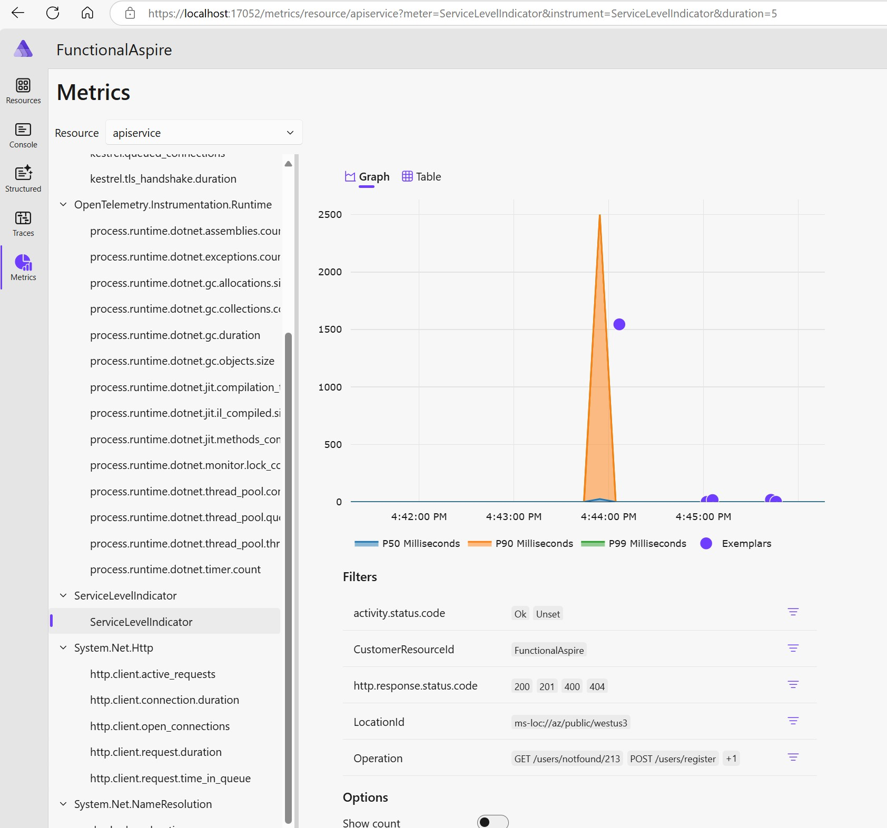

# FunctionalAspire
Functional .NET Aspire where Functional DDD and Service Level Indicators have been added.

## Functional DDD

```csharp
      userApi.MapPost("/register", (RegisterUserRequest request) =>
          FirstName.TryCreate(request.firstName)
          .Combine(LastName.TryCreate(request.lastName))
          .Combine(EmailAddress.TryCreate(request.email))
          .Bind((firstName, lastName, email) => User.TryCreate(firstName, lastName, email, request.password))
          .ToOkResult());
```

## Service level Indicators
```csharp
      RouteGroupBuilder userApi = app.MapGroup("/users")
        .AddServiceLevelIndicator();
```


