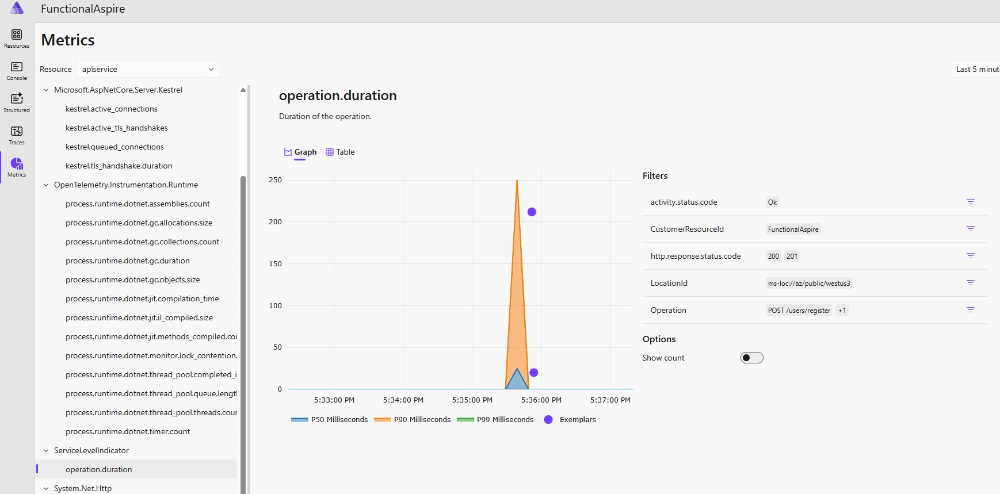

# FunctionalAspire
Functional .NET Aspire where Functional DDD and Service Level Indicators have been added.

## Functional DDD

```csharp
      userApi.MapPost("/register", (RegisterUserRequest request) =>
          FirstName.TryCreate(request.firstName)
          .Combine(LastName.TryCreate(request.lastName))
          .Combine(EmailAddress.TryCreate(request.email))
          .Bind((firstName, lastName, email) => User.TryCreate(firstName, lastName, email, request.password))
          .ToOkResult());
```

## Service level Indicators
```csharp
      RouteGroupBuilder userApi = app.MapGroup("/users")
        .AddServiceLevelIndicator();
```

## Metric


## Trace Okay

```
// Okay
POST {{HostAddress}}/users/register
Content-Type: application/json
Accept: application/json

{
  "firstName": "Xavier",
  "lastName": "John",
  "email": "xa@somewhere.com",
  "password": "KeepItSimple"
}
###
```


## Trace Error
```
// Bad request
POST {{HostAddress}}/users/register
Content-Type: application/json
Accept: application/json

{
  "firstName": "string",
  "lastName": "",
  "email": "xa.com",
  "password": "string"
}
###
```

